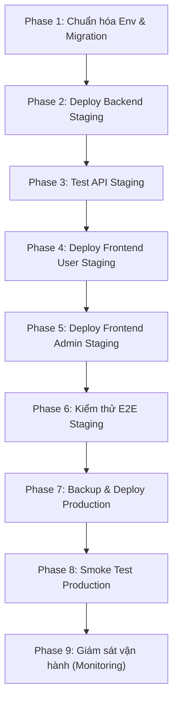

# Danh Sách Kiểm Tra & Kế Hoạch Triển Khai Hệ Thống (PRODUCTION DEPLOY CHECKLIST & PLAN)

Tài liệu này đặc tả danh sách các điều kiện kiểm tra (Checklist) về môi trường, bảo mật, cơ sở dữ liệu, máy chủ Backend và giao diện Frontend, đồng thời đề xuất lộ trình từng bước để đưa hệ thống Điện Lạnh 247 ra vận hành thực tế (Production) một cách an toàn nhất.

---

## 1. Tổng Quan Trạng Thái Hiện Tại
* **Môi trường phát triển cục bộ với Mock API:** **PASS** (100%).
* **Môi trường phát triển cục bộ với Backend NestJS + MySQL:** **PASS** (100%).
* **Kiểm thử E2E Giao diện Khách hàng (User App):** **PASS** (100%).
* **Kiểm thử E2E Giao diện Quản trị (Admin App):** **PASS** (100%).
* **Triển khai Production thực tế (Production Deploy):** **CHƯA THỰC HIỆN** (Mục tiêu của tài liệu này là chuẩn bị).

---

## 2. Danh Sách Kiểm Tra Môi Trường Production (Environment Checklist)
Trước khi triển khai, các dịch vụ hạ tầng cần được thiết lập đúng chuẩn:

- `[ ]` **Phiên bản Node.js:** Đảm bảo sử dụng phiên bản Node.js LTS tương thích (đề xuất v18 hoặc v20).
- `[ ]` **Cơ sở dữ liệu MySQL:** Thiết lập máy chủ MySQL độc lập (ví dụ: Amazon RDS, Google Cloud SQL, hoặc VPS riêng), có phân quyền tài khoản truy cập cơ sở dữ liệu tối thiểu.
- `[ ]` **Cấu hình `DATABASE_URL`:** Khai báo biến môi trường kết nối MySQL an toàn, sử dụng giao thức bảo mật nếu có hỗ trợ.
- `[ ]` **Chìa khóa bảo mật `JWT_SECRET`:** Thay thế mã bí mật mặc định bằng một chuỗi ký tự ngẫu nhiên, dài và có độ phức tạp cao.
- `[ ]` **Cấu hình CORS Origin:** Chỉ định cấu hình CORS trên NestJS trỏ chính xác về domain của `frontend-user` và `frontend-admin`. Tuyệt đối không sử dụng `*` trên production.
- `[ ]` **Cổng kết nối (Port) & Tên miền (Domain):**
  * Backend API: Ví dụ `api.dienlanh247.vn` (mặc định cổng 80/443 qua Reverse Proxy).
  * Frontend User: Ví dụ `dienlanh247.vn`
  * Frontend Admin: Ví dụ `admin.dienlanh247.vn`
- `[ ]` **Chứng chỉ bảo mật HTTPS/SSL:** Đảm bảo toàn bộ các domain trên đều được cấu hình HTTPS (sử dụng Let's Encrypt hoặc nhà cung cấp SSL khác).
- `[ ]` **Cấu hình Reverse Proxy:** Sử dụng Nginx hoặc Cloudflare làm cổng kết nối bảo vệ, cấu hình rate limiting và chặn tấn công cơ bản.
- `[ ]` **Quản lý Tài nguyên Tĩnh (Static Assets):** Cấu hình CDN hoặc dịch vụ lưu trữ đám mây (ví dụ: Cloudinary hoặc AWS S3) để lưu trữ hình ảnh sản phẩm và thợ sửa chữa, thay thế các link placeholder.
- `[ ]` **Ghi nhật ký & Giám sát (Logging & Monitoring):** Cấu hình Winston/Pino cho NestJS và tích hợp các công cụ giám sát lỗi (ví dụ: Sentry, PM2 Metrics).
- `[ ]` **Sao lưu dự phòng (Database Backup):** Thiết lập lịch sao lưu tự động hàng ngày cho cơ sở dữ liệu MySQL.

---

## 3. Danh Sách Kiểm Tra Bảo Mật (Security Checklist)
- `[ ]` **Mật khẩu quản trị mặc định:** Bắt buộc thay đổi mật khẩu của tài khoản `admin@dienlanh247.vn` (mặc định `admin123` phải bị hủy bỏ).
- `[ ]` **Bảo vệ biến môi trường:** Kiểm tra kỹ để đảm bảo không có tệp tin `.env` hay `.env.local` nào bị commit lên Git repository.
- `[ ]` **Bảo vệ Endpoint Admin:** Đảm bảo toàn bộ các API quản trị đều được bọc bởi `JwtAuthGuard` và `RolesGuard` với quyền `ADMIN` hoặc `SUPERADMIN`.
- `[ ]` **Tần suất yêu cầu (Rate Limiting):** Bật và tinh chỉnh cấu hình `@nestjs/throttler` để chống tấn công từ chối dịch vụ (DDoS) vào các endpoint nhạy cảm (như đặt hàng, đặt lịch, đăng nhập).
- `[ ]` **Kiểm thử dữ liệu đầu vào (Input Validation):** Đảm bảo tất cả các DTO đều sử dụng `class-validator` để lọc và loại bỏ dữ liệu độc hại.
- `[ ]` **Stack Trace:** Cấu hình NestJS để không in ra chi tiết stack trace của lỗi ở môi trường production nhằm tránh lộ thông tin cấu trúc thư mục.
- `[ ]` **Dữ liệu hạt giống (Seed Data):** Tuyệt đối không chạy script seed dữ liệu demo lên database production. Chỉ nạp các dữ liệu danh mục chuẩn và tài khoản admin khởi tạo ban đầu.

---

## 4. Danh Sách Kiểm Tra Cơ Sở Dữ Liệu (Database Checklist)
- `[ ]` **Chuyển đổi cơ chế đồng bộ:** Không được sử dụng `prisma db push` trên production.
- `[ ]` **Tạo Migration chính thức:** Chạy lệnh dưới đây ở local để tạo tệp migration đầu tiên lưu vào thư mục `prisma/migrations`:
  ```bash
  npx prisma migrate dev --name init_production
  ```
- `[ ]` **Áp dụng Migration:** Khi deploy lên server, áp dụng cấu trúc bảng bằng lệnh:
  ```bash
  npx prisma migrate deploy
  ```
- `[ ]` **Quy trình sao lưu:** Thực hiện backup cơ sở dữ liệu cũ trước khi áp dụng bất kỳ migration mới nào.
- `[ ]` **Kịch bản khôi phục (Rollback Plan):** Chuẩn bị sẵn kịch bản khôi phục dữ liệu về phiên bản trước đó nếu quá trình chạy migration gặp lỗi.

---

## 5. Danh Sách Kiểm Tra Máy Chủ Backend (Backend Checklist)
- `[ ]` Chạy biên dịch dự án không lỗi: `npm run build`.
- `[ ]` Xác thực cấu trúc Prisma schema: `npx prisma validate`.
- `[ ]` Sinh mã nguồn Prisma Client: `npx prisma generate`.
- `[ ]` Kiểm tra hoạt động của cơ chế tự động tính giá đơn hàng (Server-side Pricing) và khấu trừ tồn kho.
- `[ ]` Kiểm tra hoạt động của cơ chế tự động khóa trạng thái thợ sửa chữa khi có job hoạt động.
- `[ ]` Kiểm tra tính đúng đắn của các biểu đồ và số liệu dashboard.

---

## 6. Danh Sách Kiểm Tra Frontend Khách Hàng (User App Checklist)
- `[ ]` Biên dịch dự án thành công: `npm run build`.
- `[ ]` Cấu hình biến môi trường `VITE_API_BASE_URL` trỏ chính xác về domain API production.
- `[ ]` Kiểm tra hiển thị trang chủ, danh sách sản phẩm, chi tiết sản phẩm.
- `[ ]` Kiểm tra luồng thêm vào giỏ hàng, đặt hàng thành công.
- `[ ]` Kiểm tra luồng tra cứu lịch sử đơn hàng qua số điện thoại và hủy đơn hàng.
- `[ ]` Kiểm tra luồng đặt lịch sửa chữa thiết bị.
- `[ ]` Kiểm tra hiển thị tương thích trên các thiết bị di động (Responsive Layout).

---

## 7. Danh Sách Kiểm Tra Giao Diện Quản Trị (Admin App Checklist)
- `[ ]` Biên dịch dự án thành công: `npm run build`.
- `[ ]` Cấu hình biến môi trường `VITE_API_BASE_URL` trỏ chính xác về domain API production.
- `[ ]` Kiểm tra đăng nhập, lưu trữ token và tự động đăng xuất khi hết hạn phiên làm việc.
- `[ ]` Kiểm tra thống kê KPI doanh thu và đơn hàng trên Dashboard.
- `[ ]` Kiểm tra các chức năng quản trị đơn hàng, sản phẩm, cấu hình hệ thống.
- `[ ]` Kiểm tra chức năng phân công kỹ thuật viên và hoàn tất lịch sửa chữa.

---

## 8. Lộ Trình Triển Khai Đề Xuất (Deployment Phases)



* **Phase 1:** Thiết lập biến môi trường production và tạo tệp tin migration chính thức từ schema.
* **Phase 2:** Triển khai mã nguồn backend lên môi trường Staging (môi trường thử nghiệm tương đồng production).
* **Phase 3:** Chạy kịch bản test tự động `test_nestjs_api.js` để quét toàn bộ lỗi tích hợp trên Staging.
* **Phase 4 & 5:** Triển khai Frontend User và Frontend Admin lên Staging.
* **Phase 6:** Đội ngũ QA/QC thực hiện kiểm thử E2E thủ công toàn bộ các luồng chức năng trên trình duyệt ở môi trường Staging.
* **Phase 7:** Thực hiện sao lưu dữ liệu hiện tại, chạy lệnh deploy backend và frontend lên môi trường Production chính thức.
* **Phase 8:** Thực hiện các giao dịch thử nghiệm nhỏ (Smoke Test) trên hệ thống thật để đảm bảo mọi chức năng cốt lõi hoạt động bình thường.
* **Phase 9:** Theo dõi hiệu năng hệ thống, tốc độ phản hồi API và các log lỗi thông qua dashboard giám sát.

---

## 9. Những Việc Tuyệt Đối Chưa Làm Ở Bước Này
1. **Không xóa Mock API:** Giữ nguyên để phục vụ phát triển cục bộ và fallback khi cần.
2. **Không đổi mặc định `.env.example`:** Giữ nguyên địa chỉ Mock API để dự án dễ dàng tiếp cận với các nhà phát triển mới.
3. **Không deploy khi chưa có tệp migration:** Việc chạy `db push` trực tiếp lên cơ sở dữ liệu production là vô cùng nguy hiểm và có thể gây mất mát dữ liệu khách hàng.
4. **Không nạp dữ liệu seed demo lên production:** Tránh làm ô nhiễm dữ liệu báo cáo doanh thu và danh sách thợ thật.

---

## 10. Kết Luận
* **Môi trường Local/Dev:** **ĐÃ SẴN SÀNG**.
* **Môi trường Staging:** Có thể chuẩn bị triển khai ngay.
* **Môi trường Production:** Cần hoàn tất đầy đủ các hạng mục trong danh sách kiểm tra này trước khi tiến hành cấu hình tên miền chính thức.
