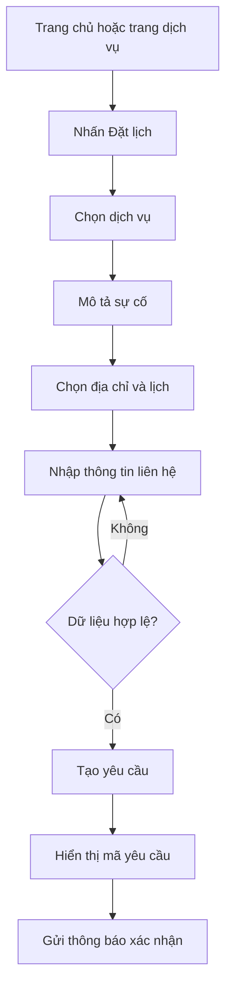
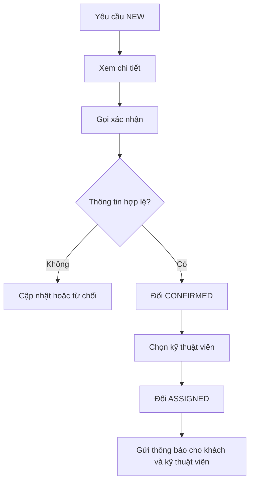
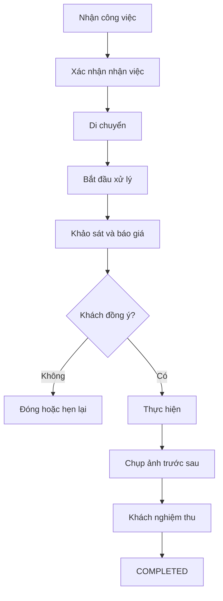

# 05. User Flows

## Flow A — Khách đặt dịch vụ tiêu chuẩn

## Flow B — Yêu cầu khẩn cấp

- Khách chọn mức khẩn cấp.
- UI hiển thị cảnh báo an toàn phù hợp.
- API gắn mức ưu tiên `URGENT`.
- Admin nhận badge/cảnh báo.
- Điều phối viên xác nhận và phân công sớm.

## Flow C — Admin tiếp nhận

## Flow D — Kỹ thuật viên xử lý

## Flow E — Quản trị nội dung

- Tạo bản nháp.
- Nhập slug, metadata và nội dung.
- Upload ảnh.
- Xem trước.
- Xuất bản hoặc lên lịch.
- Ghi lịch sử người chỉnh sửa.

## Quy tắc lỗi

- Mất mạng: giữ dữ liệu form trong phiên.
- API timeout: cho phép gửi lại, không tạo trùng.
- Upload lỗi: cho phép xóa/tải lại từng ảnh.
- Slot hết chỗ: yêu cầu chọn slot khác trước khi gửi.
- Yêu cầu trùng số điện thoại và thời gian: hiển thị cảnh báo cho admin.
