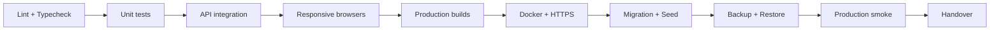

# Biên bản nghiệm thu và bàn giao Giai đoạn 15

## 1. Phạm vi

Giai đoạn 15 đưa hệ thống Điện Lạnh 247 từ trạng thái hoàn thiện tính năng sang trạng thái có thể triển khai, theo dõi và phục hồi. Phạm vi gồm bộ test, container production, HTTPS reverse proxy, migration/seed, backup/restore, health/alert, tài liệu vận hành và quality gate cuối.

## 2. Thành phần bàn giao

| Nhóm | Thành phần | Trạng thái |
|---|---|---|
| Bộ test | unit test auth/products/health | Đã nghiệm thu CI |
| API E2E | đặt dịch vụ → phân công → báo giá → hoàn thành | Đã nghiệm thu CI |
| RBAC E2E | khách hàng không truy cập API admin | Đã nghiệm thu CI |
| Responsive | desktop/tablet/mobile; Chromium/Firefox/WebKit | Đã nghiệm thu CI |
| Deployment | Dockerfile cho backend/user/admin | Đã nghiệm thu CI |
| Orchestration | MySQL, app containers, volumes, health checks | Đã nghiệm thu CI |
| Gateway | Nginx, HTTPS, HTTP redirect, host routing | Đã nghiệm thu CI |
| Data safety | migration deploy, seed, backup, checksum, restore | Đã nghiệm thu CI |
| Observability | structured log, live/ready, webhook monitor | Đã nghiệm thu CI |
| Documentation | install, operations, admin, source handover | Đã bàn giao trong source |

## 3. Chuỗi nghiệm thu

Không được đánh dấu hoàn tất nếu bỏ qua bất kỳ cổng nào. Artifact CI chứa log, coverage, Playwright evidence và kết quả restore/smoke.

## 4. Tiêu chí nghiệm thu

### Build production

- [x] Backend production build thành công.
- [x] Frontend user production build thành công.
- [x] Frontend admin production build thành công.
- [x] Ba Docker image ứng dụng build thành công.
- [x] `docker compose config` hợp lệ và stack khởi động healthy.

### Luồng quan trọng

- [x] Health live/ready pass.
- [x] Khách hàng tạo yêu cầu dịch vụ thành công.
- [x] Admin đăng nhập thành công bằng HttpOnly cookie.
- [x] Khách hàng bị chặn khi gọi API admin.
- [x] Admin xác nhận và phân công kỹ thuật viên.
- [x] Yêu cầu chuyển sang đang xử lý.
- [x] Báo giá được tính và khách hàng chấp thuận.
- [x] Biên bản hoàn thành được tạo.
- [x] Workspace phản ánh trạng thái hoàn thành.
- [x] Logout thu hồi quyền truy cập.

### Responsive và trình duyệt

- [x] 1440×900 Chromium.
- [x] 768×1024 Chromium.
- [x] Mobile Chromium.
- [x] Desktop Firefox.
- [x] Mobile WebKit.
- [x] Không horizontal overflow và không page runtime error trong ma trận nghiệm thu.

### Backup và restore

- [x] Tạo `.sql.gz` thành công.
- [x] Tạo/kiểm tra SHA-256 thành công.
- [x] Restore vào database tạm thành công.
- [x] Chạy migration sau restore thành công.
- [x] Readiness và smoke test sau restore thành công.
- [x] RPO/RTO của drill được ghi lại.

### Tự vận hành — xác nhận thủ công khi bàn giao người thật

- [ ] Người tiếp nhận tự tạo env từ template.
- [ ] Người tiếp nhận tự cài certificate.
- [ ] Người tiếp nhận tự khởi chạy compose.
- [ ] Người tiếp nhận đọc được structured log và request ID.
- [ ] Người tiếp nhận tự chạy backup/restore drill.
- [ ] Người tiếp nhận biết rollback image và quy trình incident.

Sáu mục trên không được tự động đánh dấu bằng CI; đại diện vận hành/người tiếp nhận phải thực hiện và ký tại Mục 8.

## 5. Bảo vệ tương thích Giai đoạn 1–14

- Không thay đổi Prisma schema trong Phase 15.
- Không thay đổi order pricing, cart/checkout, inventory hoặc payment calculations.
- Không thay đổi service transition và quotation calculations.
- Không thay đổi CMS, notification outbox hoặc SEO routing.
- Giữ nguyên refresh rotation, RBAC, upload validation, secret scan và audit hash chain của Phase 14.
- Branch Phase 15 phải có `behind_by=0` so với head Phase 14 tại thời điểm nghiệm thu.

## 6. Bằng chứng CI

| Trường | Giá trị |
|---|---|
| Workflow | Phase 15 Production Readiness |
| Run ID | `29471068562` |
| Head SHA | `fede43b2cb560ae043dcea67a134a199c8eaee02` |
| Kết luận | `SUCCESS` — 4/4 jobs pass |
| Acceptance artifact | `phase15-acceptance-evidence`, ID `8364829099` |
| Artifact digest | `sha256:19dfdc1216a5f9e19ab32260b171a4b74387df4be92b8800a02e9735fe0283f1` |
| Backup checksum | `dcad1b6ae0e9ff7c31f5366b182c6bf1ed463a5deb6ef1185fe1e0d19087f9d3` |
| Restore target | `dien_lanh_247_restore` |
| Restore verification | `restored_users=1`, migration deploy và smoke pass |
| Recovery drill | RPO bằng thời điểm backup của fixture; RTO restore đo được `4 giây` trong CI |
| Retention | Artifact 30 ngày; database backup fixture 14 ngày |

Các số liệu CI là bằng chứng khả năng phục hồi của cấu hình. RTO/RPO production thực tế phải được đo lại trên staging có dung lượng và hạ tầng gần production.

## 7. Các việc bắt buộc khi go-live thật

- Cấp DNS và certificate CA thật.
- Inject secret qua secret manager.
- Đặt `RUN_SEED=false` sau bootstrap ban đầu.
- Lập lịch backup và health monitor.
- Lưu backup mã hóa ngoài máy chủ ứng dụng.
- Cấu hình người nhận cảnh báo và escalation.
- Chạy restore drill trên staging gần production.
- Đổi mật khẩu seed admin và review RBAC.

## 8. Xác nhận bàn giao

| Vai trò | Họ tên | Ngày | Kết quả/Ký xác nhận |
|---|---|---|---|
| Đại diện phát triển |  |  |  |
| Đại diện kiểm thử |  |  |  |
| Đại diện vận hành |  |  |  |
| Người tiếp nhận source |  |  |  |

Phần kỹ thuật tự động đã đạt. Biên bản chỉ hoàn tất về mặt tổ chức sau khi người tiếp nhận thực hiện sáu mục thủ công và các bên ký xác nhận.
