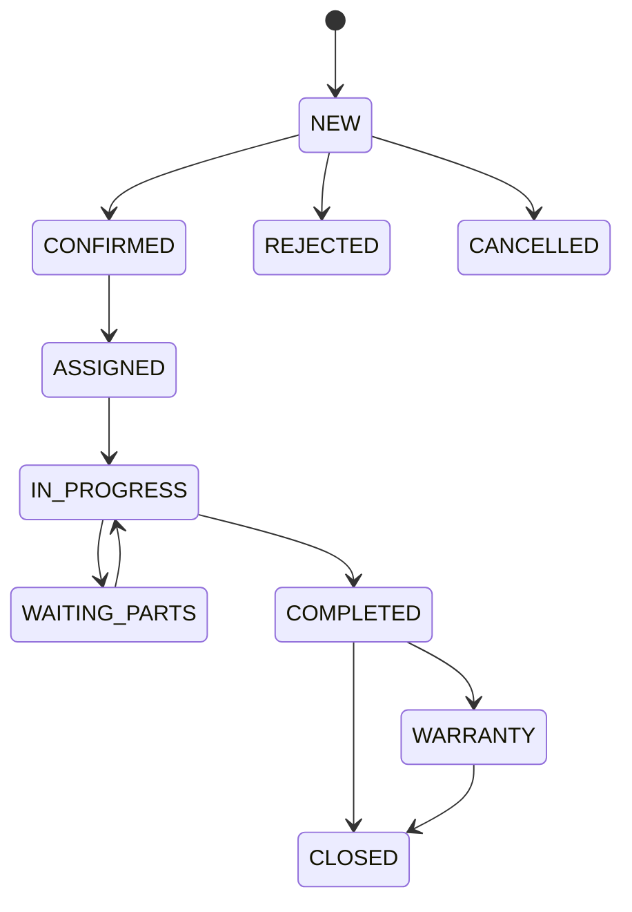

# Hướng dẫn quản trị hệ thống

## Vai trò và nguyên tắc phân quyền

| Vai trò | Phạm vi chính | Không được phép |
|---|---|---|
| `STAFF` | xem/vận hành đơn, dịch vụ, điều phối theo permission | quản lý cấu hình nhạy cảm, xóa sản phẩm, xem audit toàn cục |
| `ADMIN` | quản trị nghiệp vụ, sản phẩm, nội dung, vận hành | thao tác dành riêng cho Superadmin |
| `SUPERADMIN` | toàn bộ quyền, audit integrity, thao tác nguy hiểm | không chia sẻ tài khoản hoặc dùng cho công việc hằng ngày |

Frontend chỉ hỗ trợ trải nghiệm; backend mới là nguồn quyết định quyền. Không kiểm thử phân quyền bằng cách nhìn nút ẩn/hiện—phải xác minh API trả 401/403 khi request bị sửa.

## Đăng nhập an toàn

- Dùng tài khoản cá nhân, không dùng tài khoản chung.
- Đổi ngay mật khẩu seed sau lần đăng nhập đầu tiên.
- Không gửi cookie/token qua chat hoặc ticket.
- Khi nghi ngờ lộ phiên, dùng “Đăng xuất tất cả thiết bị”.
- Sau nhiều lần sai hệ thống sẽ khóa tạm; không cố thử liên tục.

## Vận hành yêu cầu dịch vụ



Quy trình chuẩn:

1. mở yêu cầu mới và kiểm tra thông tin liên hệ;
2. xác nhận hoặc hẹn lại; ghi lý do rõ ràng;
3. phân công kỹ thuật viên có đúng kỹ năng, khu vực và lịch trống;
4. ghi chú nội bộ, không đưa secret hoặc dữ liệu thẻ vào ghi chú;
5. chuyển `IN_PROGRESS` khi kỹ thuật viên thực sự bắt đầu;
6. tạo báo giá theo dòng công việc/vật tư;
7. chờ khách hàng chấp thuận qua token xác nhận;
8. ghi nhận thanh toán đúng phương thức và tham chiếu;
9. lập biên bản hoàn thành, chẩn đoán, việc đã làm và khuyến nghị;
10. tạo bảo hành nếu áp dụng và đóng yêu cầu khi hoàn tất.

Không ép trạng thái bằng sửa request. Backend sẽ từ chối transition không hợp lệ hoặc hoàn thành khi thiếu điều kiện.

## Báo giá và thanh toán

- Mỗi dòng báo giá phải có loại `LABOR` hoặc `MATERIAL`, mô tả, số lượng, đơn vị và đơn giá.
- Kiểm tra chiết khấu cố định/phần trăm và thuế trước khi gửi.
- Không nhập số thẻ, CVV, PIN hoặc token cổng thanh toán vào ghi chú.
- Khi khách hàng từ chối, tạo version báo giá mới thay vì sửa dấu vết cũ.
- Đối chiếu tổng tiền đã thanh toán với báo giá được chấp thuận trước khi đóng hồ sơ.

## Quản lý sản phẩm và nội dung

- Sản phẩm bị xóa theo cơ chế soft-delete; thao tác cần `SUPERADMIN`, xác nhận nguy hiểm và lý do.
- Kiểm tra ảnh đúng JPG/PNG/WebP, tối đa 5 MB và không dùng file đổi đuôi.
- Nội dung CMS cần preview trước khi publish.
- Không chèn script tùy ý, iframe không tin cậy hoặc URL không HTTPS.
- Sau cập nhật lớn, kiểm tra frontend user trên desktop và mobile.

## Audit log

Chỉ `SUPERADMIN` xem audit toàn cục. Audit dùng để trả lời:

- ai thực hiện;
- hành động gì;
- tài nguyên nào;
- kết quả success/failure/denied/rate-limited;
- thời điểm và request ID.

Kiểm tra integrity:

```text
GET /api/v1/admin/audit-logs/integrity
```

Nếu `valid=false`, không xóa hoặc sửa file. Thực hiện quy trình incident trong `OPERATIONS_RUNBOOK.md`.

## Checklist cuối ca

- [ ] Không còn yêu cầu urgent chưa có người phụ trách.
- [ ] Các yêu cầu đang xử lý có lịch và kỹ thuật viên hợp lệ.
- [ ] Báo giá chờ phản hồi được theo dõi.
- [ ] Thanh toán và biên bản hoàn thành đã đối chiếu.
- [ ] Không có cảnh báo SLA nghiêm trọng chưa xử lý.
- [ ] Không có thao tác denied/rate-limited bất thường trong audit.
- [ ] Không để tài khoản Superadmin đăng nhập trên máy dùng chung.

## Khi cần hỗ trợ kỹ thuật

Cung cấp request ID, thời gian, endpoint/chức năng, vai trò người dùng và bước tái hiện. Không gửi password, token, cookie, database URL hoặc ảnh chứa dữ liệu thẻ. Với lỗi giao diện, đính kèm viewport, trình duyệt và screenshot đã che dữ liệu cá nhân.
