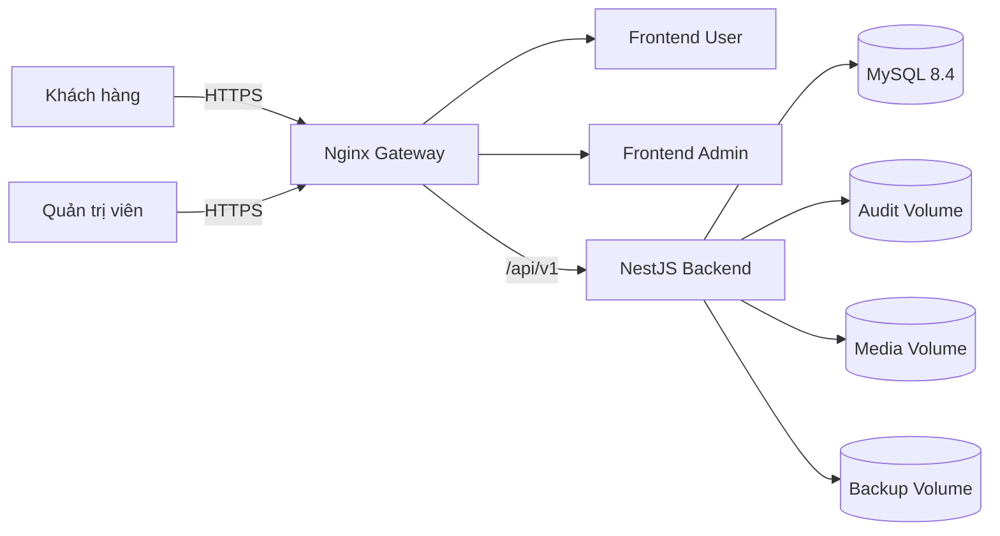

# Hướng dẫn cài đặt và triển khai production

> Mục tiêu: một kỹ sư mới có thể đưa Điện Lạnh 247 lên máy chủ sạch, kiểm tra tình trạng và quay lui an toàn mà không cần biết lịch sử 14 giai đoạn trước.

## Kiến trúc triển khai



Bốn container ứng dụng không công khai cổng trực tiếp. Chỉ gateway mở cổng 80/443; database và backend nằm trong mạng Docker riêng.

## 1. Điều kiện máy chủ

- Linux x86_64/arm64 có Docker Engine và Docker Compose v2.
- Tối thiểu 2 vCPU, 4 GB RAM, 30 GB SSD cho môi trường nhỏ.
- DNS cho `USER_DOMAIN` và `ADMIN_DOMAIN` trỏ về máy chủ.
- Chứng thư TLS hợp lệ gồm `fullchain.pem` và `privkey.pem`.
- Quyền đọc secret từ secret manager; không lưu secret trong Git.
- Đồng bộ thời gian NTP và timezone vận hành `Asia/Bangkok`.

## 2. Chuẩn bị source và biến môi trường

```bash
 git clone https://github.com/thodz06012005-blip/dien-lanh-247-ecommerce.git
 cd dien-lanh-247-ecommerce
 git checkout agent/phase-15-production-readiness
 cp deploy/env/production.env.example deploy/env/production.env
 chmod 600 deploy/env/production.env
```

Thay mọi giá trị dạng `<...>` bằng secret thật. Tối thiểu phải có database credential, JWT access/refresh secret, audit salt và mật khẩu seed admin dùng một lần. `NODE_ENV=production` sẽ từ chối secret ngắn, placeholder, cookie không Secure hoặc CORS wildcard.

## 3. Cài chứng thư HTTPS

Production: sao chép chứng thư CA cấp vào:

```text
 deploy/certs/fullchain.pem
 deploy/certs/privkey.pem
```

```bash
chmod 600 deploy/certs/privkey.pem
chmod 644 deploy/certs/fullchain.pem
```

Chỉ để kiểm thử local:

```bash
USER_DOMAIN=dienlanh247.local \
ADMIN_DOMAIN=admin.dienlanh247.local \
sh deploy/scripts/generate-local-cert.sh
```

Không sử dụng self-signed certificate cho người dùng thật.

## 4. Kiểm tra cấu hình trước khi chạy

```bash
docker compose \
  --env-file deploy/env/production.env \
  -f docker-compose.production.yml \
  config --quiet

npm run security:scan
```

Lệnh phải kết thúc mã `0`. Không tiếp tục nếu compose thiếu biến hoặc secret scan phát hiện credential.

## 5. Khởi chạy lần đầu

Đặt `RUN_SEED=true` đúng một lần để tạo dữ liệu nền và tài khoản admin; sau khi hoàn tất phải đổi về `false`.

```bash
docker compose \
  --env-file deploy/env/production.env \
  -f docker-compose.production.yml \
  up -d --build

docker compose -f docker-compose.production.yml ps
```

Backend entrypoint tự chạy `prisma migrate deploy` trước khi mở cổng. Không dùng `prisma migrate dev`, `db push` hoặc reset trên production.

## 6. Kiểm tra sau triển khai

```bash
curl -fsS "https://${USER_DOMAIN}/api/v1/health/live"
curl -fsS "https://${USER_DOMAIN}/api/v1/health/ready"

USER_SMOKE_URL="https://${USER_DOMAIN}" \
ADMIN_SMOKE_URL="https://${ADMIN_DOMAIN}" \
API_SMOKE_URL="https://${USER_DOMAIN}/api/v1" \
npm run smoke:production
```

Sau khi seed thành công:

1. đăng nhập admin;
2. đổi mật khẩu seed;
3. đặt `RUN_SEED=false`;
4. triển khai lại backend;
5. kiểm tra audit integrity tại `/api/v1/admin/audit-logs/integrity` bằng tài khoản `SUPERADMIN`.

## 7. Cập nhật phiên bản

```bash
npm run backup:mysql
git fetch --all --prune
git checkout <release-tag>
docker compose --env-file deploy/env/production.env -f docker-compose.production.yml build --pull
docker compose --env-file deploy/env/production.env -f docker-compose.production.yml up -d
npm run smoke:production
```

Mỗi release phải gắn tag bất biến. Không deploy trực tiếp từ nhánh đang phát triển.

## 8. Quay lui

Nếu lỗi chỉ nằm ở image, checkout release trước và chạy lại compose; không rollback migration bằng tay. Nếu schema/data bị ảnh hưởng, dừng ghi dữ liệu, tạo backup sự cố, thực hiện restore theo `OPERATIONS_RUNBOOK.md`, sau đó chạy smoke test trước khi mở lại lưu lượng.
