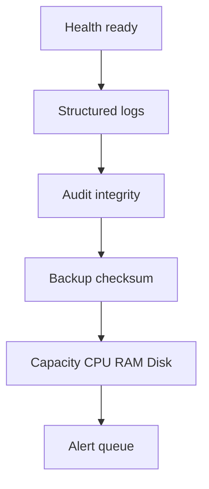

# Runbook vận hành, giám sát và phục hồi

## Mục tiêu dịch vụ

| Chỉ số | Mục tiêu ban đầu |
|---|---:|
| Availability theo tháng | ≥ 99,5% |
| RPO database | ≤ 24 giờ |
| RTO sự cố thông thường | ≤ 2 giờ |
| Thời gian phát hiện health failure | ≤ 5 phút |
| Thời gian lưu backup mặc định | 14 ngày |

Các mục tiêu cần được điều chỉnh sau khi có số liệu vận hành thật.

## Bảng điều khiển hằng ngày



Mỗi ca trực kiểm tra:

- `docker compose ps` không có container unhealthy/restarting;
- `/api/v1/health/live` trả `200` và process uptime hợp lý;
- `/api/v1/health/ready` trả database `up`;
- log không tăng đột biến 5xx/429;
- dung lượng volume database, audit, media và backup;
- backup mới nhất có file `.sql.gz` cùng `.sha256`;
- audit integrity trả `valid=true`.

## Health check và cảnh báo

Chạy bằng cron mỗi 5 phút:

```bash
*/5 * * * * cd /srv/dien-lanh-247 && \
HEALTHCHECK_URL=https://dienlanh247.example/api/v1/health/ready \
ALERT_WEBHOOK_URL='<secret-manager-reference>' \
npm run monitor:health >> /var/log/dl247-health.log 2>&1
```

Script thử lại ba lần, có timeout và chỉ gửi metadata sự cố. Không đặt webhook thật trong crontab được commit; inject từ secret store hoặc systemd EnvironmentFile có quyền `0600`.

## Log và điều tra lỗi

Backend ghi JSON một dòng cho mỗi request với `requestId`, method, path, status, duration, actor ID/role và error name. Không ghi body, cookie, authorization hoặc token.

```bash
docker compose -f docker-compose.production.yml logs --since=30m backend
docker compose -f docker-compose.production.yml logs --since=30m gateway
```

Quy trình điều tra:

1. lấy `requestId` từ phản hồi hoặc log gateway;
2. lọc backend log theo request ID;
3. kiểm tra audit log nếu là hành động quản trị;
4. xác định lỗi ứng dụng, database, tích hợp hay mạng;
5. không sao chép toàn bộ log có dữ liệu khách hàng vào ticket công khai;
6. ghi nguyên nhân gốc, phạm vi ảnh hưởng và hành động phòng ngừa.

## Backup tự động

Lịch đề xuất 02:15 hằng ngày:

```bash
15 2 * * * cd /srv/dien-lanh-247 && \
set -a && . deploy/env/production.env && set +a && \
BACKUP_DIRECTORY=/srv/dl247-backups \
npm run backup:mysql >> /var/log/dl247-backup.log 2>&1
```

Sau mỗi backup:

- upload bản mã hóa sang object storage khác máy chủ;
- bật versioning và lifecycle;
- kiểm tra checksum;
- cảnh báo nếu file quá nhỏ bất thường;
- không lưu backup trong Git hoặc thư mục public.

## Restore drill bắt buộc

Restore luôn thực hiện trên database staging/temporary trước. Ví dụ:

```bash
export NODE_ENV=staging
export DATABASE_URL='<target-staging-database-url-from-secret-manager>'
export BACKUP_DIRECTORY=/srv/dl247-backups
export RESTORE_FILE=/srv/dl247-backups/dien_lanh_247-<timestamp>.sql.gz
export RESTORE_CONFIRM=dien_lanh_247_restore_test
npm run restore:mysql
```

Utility sẽ:

1. xác minh file nằm trong `BACKUP_DIRECTORY`;
2. yêu cầu `.sql.gz` và sidecar `.sha256`;
3. đối chiếu checksum;
4. yêu cầu `RESTORE_CONFIRM` đúng tên database đích;
5. từ chối production nếu thiếu `ALLOW_PRODUCTION_RESTORE=true`;
6. truyền database credential qua environment của process con, không qua command line.

Sau restore:

```bash
npm run prisma:migrate:deploy
npm run smoke:production
```

Ghi vào biên bản: tên backup, checksum, thời gian bắt đầu/kết thúc, RPO thực tế, RTO thực tế và người thực hiện.

## Quy trình sự cố

### Backend unhealthy

1. kiểm tra `/health/live` và `/health/ready` riêng;
2. nếu live fail: xem OOM/restart và rollback image;
3. nếu ready fail: kiểm tra MySQL health, connection limit, disk và migration;
4. không restart database liên tục khi chưa chụp log/chỉ số;
5. chuyển hệ thống sang maintenance nếu có nguy cơ ghi sai dữ liệu.

### Database đầy ổ đĩa

1. dừng tác vụ không thiết yếu;
2. kiểm tra binary log, backup cũ và media đặt sai volume;
3. mở rộng volume thay vì xóa dữ liệu nghiệp vụ;
4. tạo backup mới sau khi ổn định;
5. chạy integrity/smoke tests.

### Audit integrity fail

1. giới hạn quyền truy cập máy chủ;
2. sao chép file audit và checksum theo chế độ read-only;
3. kiểm tra thay đổi filesystem, user đăng nhập và deployment gần nhất;
4. không dùng chức năng clear audit ngoài môi trường test;
5. mở incident bảo mật và luân chuyển secret nếu có dấu hiệu xâm nhập.

### Rollback release

Rollback image về release tag trước, giữ nguyên volume. Migration phải theo chiến lược backward-compatible; khi bắt buộc restore database, cần phê duyệt hai người và thông báo thời gian mất dữ liệu theo RPO.

## Bảo trì định kỳ

- Hằng tuần: xem top 5 lỗi, slow request và tỷ lệ 429.
- Hằng tháng: patch base image, kiểm tra dependency, rotate log và diễn tập restore mẫu.
- Hằng quý: rotate JWT/audit secrets theo kế hoạch, kiểm tra TLS expiry, review RBAC và diễn tập sự cố đầy đủ.
