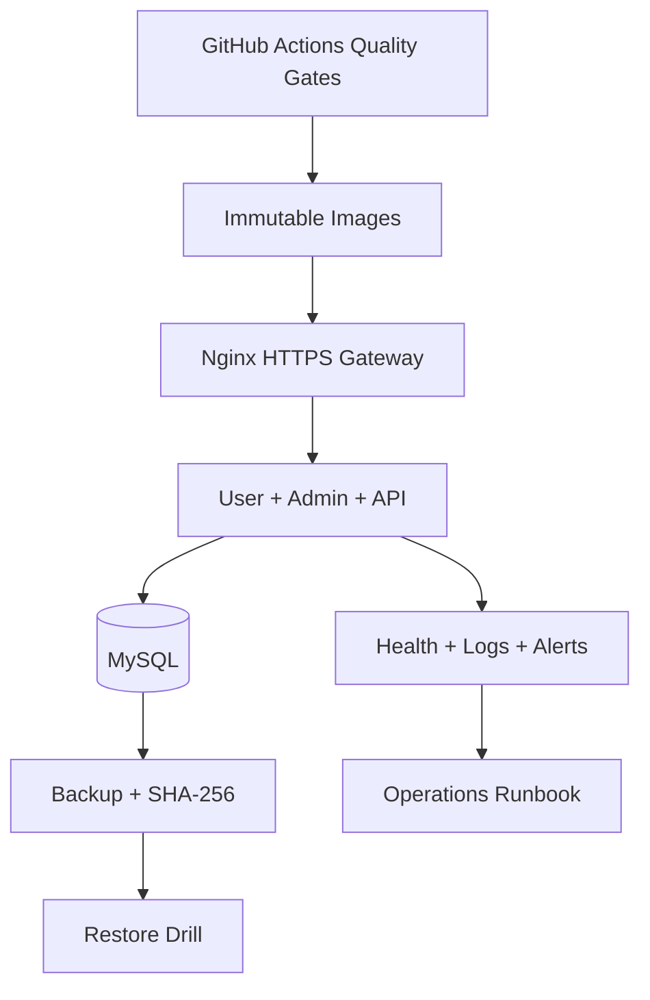

# Giai đoạn 15 — Production Readiness & Handover


## Mục tiêu

Đưa Điện Lạnh 247 lên môi trường vận hành có thể lặp lại, quan sát được và phục hồi được. Phase 15 không thêm nghiệp vụ mới; nó đóng gói và kiểm chứng toàn bộ nền tảng đã xây dựng trong 14 giai đoạn trước.

## Production cockpit



## Đầu ra

- **Bộ test:** unit test service, API integration và Playwright responsive matrix.
- **Deployment:** Dockerfile, compose production, Nginx HTTPS và env template.
- **Vận hành:** health live/ready, structured logs, alert monitor, backup/restore.
- **Tài liệu:** cài đặt, quản trị, runbook, source handover và biên bản nghiệm thu.

## Tài liệu

| Tài liệu | Mục đích |
|---|---|
| `INSTALLATION_GUIDE.md` | dựng máy chủ và triển khai production |
| `OPERATIONS_RUNBOOK.md` | health, log, alert, backup, restore, incident |
| `ADMIN_GUIDE.md` | quy trình quản trị nghiệp vụ và RBAC |
| `SOURCE_HANDOVER.md` | bản đồ source, lệnh và quy tắc tiếp nhận |
| `ACCEPTANCE_AND_HANDOVER.md` | checklist và biên bản ký nhận |
| `TEST_PLAN.md` | chiến lược, phạm vi và bằng chứng kiểm thử |

## Các lệnh chính

```bash
npm run test:unit
npm run test:api:phase15
npm run test:responsive
npm run security:scan
npm run backup:mysql
npm run restore:mysql
npm run smoke:production
```

## Merge order

Phase 15 là stacked PR trên `agent/phase-14-security-hardening`. Giữ Draft và không merge trước Phase 14. Sau khi base thay đổi, phải kiểm tra `behind_by=0` và chạy lại toàn bộ Phase 15 workflow.
