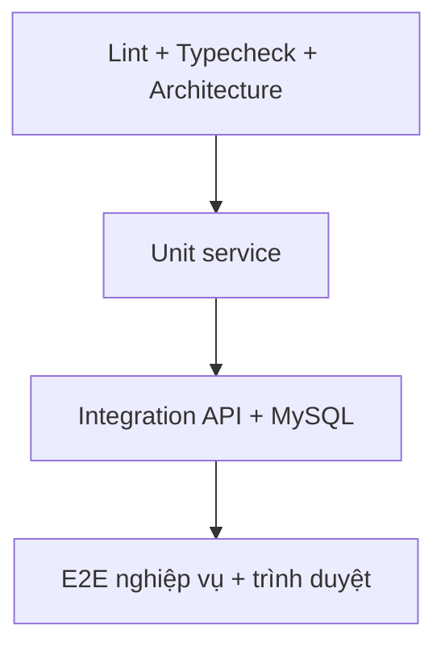

# Kế hoạch kiểm thử cuối Giai đoạn 15

## Mô hình kim tự tháp

## 1. Static quality

- Secret scan trên tracked files.
- Lint mock API, frontend-user, frontend-admin và backend.
- TypeScript type-check ba ứng dụng.
- Architecture contracts toàn repository, frontend và backend.
- Phase 14 security contracts được kế thừa.
- Phase 15 deployment/operations contracts.

## 2. Unit test

| Service | Hành vi chính |
|---|---|
| `LoginRateLimitService` | normalize, forwarded IP, lockout, retry time, reset sau login |
| `ProductsService` | public active filter, unknown category, stock mapping, soft delete, not found |
| `HealthService` | liveness không phụ thuộc DB, readiness DB up/down |

Coverage được xuất dưới dạng artifact. Mục tiêu ban đầu: các service mới/thay đổi trong Phase 15 có branch coverage rõ ràng; không dùng coverage tổng thấp của code legacy để che lỗi test.

## 3. API integration/E2E

Test `phase15-critical-flows.integration.mjs` chạy với MySQL thật và backend build thật:

1. live/ready;
2. lấy danh mục dịch vụ seed;
3. tạo yêu cầu dịch vụ;
4. đăng ký khách hàng;
5. xác minh khách hàng bị 403 ở API admin;
6. admin login bằng cookie;
7. xác nhận yêu cầu;
8. phân công `TECH-001` đúng kỹ năng/khu vực;
9. chuyển `IN_PROGRESS`;
10. lập báo giá và kiểm tra tổng;
11. khách hàng chấp thuận báo giá;
12. lập biên bản hoàn thành;
13. workspace phản ánh `COMPLETED`;
14. logout và xác minh phiên không còn quyền.

Database CI được tạo mới cho mỗi job, chạy migration và seed đầy đủ.

## 4. Responsive/browser

Playwright chạy 30 trường hợp cơ bản: 5 trang customer × 5 project cộng trang admin login trên từng project. Ma trận:

- Chromium 1440×900;
- Chromium tablet 768×1024;
- Chromium mobile Pixel;
- Firefox desktop;
- WebKit mobile iPhone.

Mỗi test kiểm tra status, body, title, runtime error và horizontal overflow. Screenshot, trace và video lỗi được giữ trong artifact.

## 5. Container và production smoke

- Validate compose.
- Build backend/frontend images.
- Khởi chạy MySQL, migration, seed, backend, frontend và Nginx HTTPS.
- Kiểm tra container health.
- Smoke health live/ready, HTML portals, HSTS/no-sniff, lỗi 404 chuẩn hóa.

## 6. Backup/restore drill

1. tạo dữ liệu sentinel;
2. chạy backup `.sql.gz`;
3. kiểm tra `.sha256`;
4. tạo database restore tạm;
5. chạy restore utility với confirmation;
6. truy vấn sentinel;
7. chạy migration status/ready;
8. ghi thời gian RPO/RTO vào artifact.

## 7. Điều kiện fail-fast

Pipeline thất bại nếu bất kỳ bước nào đỏ. Artifact vẫn được upload bằng `if: always()` để điều tra. Không đánh dấu PR ready khi test bị skip do thiếu certificate, browser, database hoặc Docker.

## 8. Bằng chứng

Artifact `phase15-acceptance-evidence` gồm:

- lint/typecheck/build logs;
- unit coverage;
- integration log;
- Playwright HTML report, screenshots, traces/video lỗi;
- compose/container/smoke log;
- backup checksum và restore drill log;
- toàn bộ tài liệu Phase 15.
