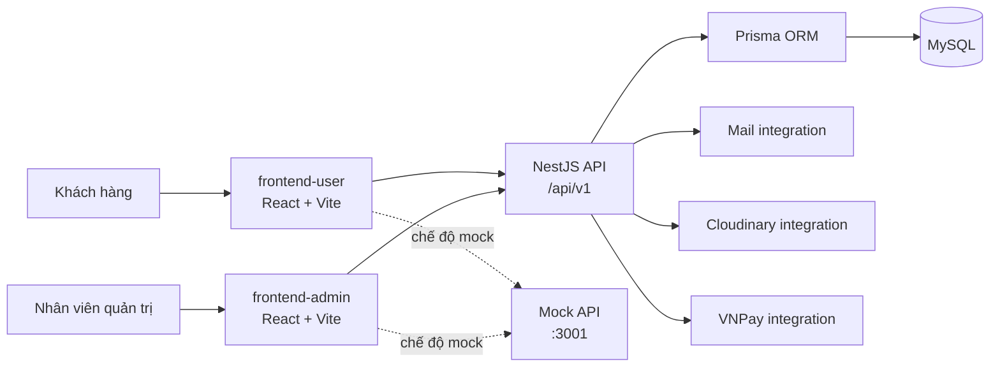

# Kiến trúc hệ thống Giai đoạn 2

## 1. Sơ đồ cấp cao



## 2. Nguyên tắc kiến trúc

1. **Một trách nhiệm rõ ràng:** router, provider, API client, state và UI không đặt chung trong một file bootstrap.
2. **Cấu hình bên ngoài code:** URL, port, secret và feature flag đến từ biến môi trường.
3. **Contract trước triển khai:** frontend và backend dùng envelope và mã lỗi thống nhất.
4. **Backward compatible:** interceptor không bọc lồng response đã có `success`.
5. **Fail fast:** cấu hình không hợp lệ làm ứng dụng dừng ngay khi khởi động.
6. **Reproducible build:** dùng lockfile và `npm ci` trong CI.
7. **Defense in depth:** validation, CORS, cookie, request limits, security headers, RBAC và audit phối hợp với nhau.
8. **Observability tối thiểu:** mọi request có `X-Request-Id` xuyên suốt response thành công/lỗi.

## 3. Kiến trúc frontend

### 3.1. Luồng bootstrap

```text
main.tsx
  └── AppProviders
      ├── AppErrorBoundary
      ├── QueryClientProvider
      ├── ConfigProvider (admin)
      └── App
          └── AppRouter
              ├── public routes
              ├── protected routes
              └── layouts/pages
```

### 3.2. Trách nhiệm thư mục

| Thư mục | Trách nhiệm |
| --- | --- |
| `src/app` | Provider cấp ứng dụng, composition root |
| `src/components` | UI tái sử dụng và error boundary |
| `src/config` | Đọc và validate cấu hình public |
| `src/layouts` | Khung trang và navigation |
| `src/pages` | Route-level UI và orchestration |
| `src/router` | Khai báo route, guard, 404 |
| `src/services` | API client và integration phía trình duyệt |
| `src/store` | Zustand client state |
| `src/types` | Type chia sẻ trong từng ứng dụng |

### 3.3. Quản lý state

- **Server state:** React Query quản lý cache, loading, retry và invalidation.
- **Client/session state:** Zustand quản lý auth và state dùng xuyên trang.
- **Form state:** React Hook Form ở customer khi form phức tạp.
- **URL state:** search params dùng cho filter, sort, page để hỗ trợ chia sẻ URL và back/forward.
- Không sao chép dữ liệu API vào Zustand nếu React Query đã là nguồn sự thật.

### 3.4. API client

API client có:

- `baseURL` và timeout từ cấu hình đã validate.
- `withCredentials` cho cookie HttpOnly.
- `Accept: application/json`.
- `X-Request-Id` cho correlation.
- Customer refresh token request được gộp để tránh nhiều refresh song song.
- Admin tự clear session khi server trả `401` ngoài endpoint login.
- Axios error được giữ nguyên để caller đọc status/code/details.

### 3.5. Error boundary

Error boundary bắt lỗi render/lifecycle của React ở cấp ứng dụng. Nó không thay thế:

- xử lý lỗi Promise;
- React Query error state;
- validation form;
- lỗi API có thể phục hồi.

Màn hình lỗi chỉ hiển thị chi tiết kỹ thuật trong development.

## 4. Kiến trúc backend

### 4.1. Composition root

```text
main.ts
  ├── ConfigService
  ├── global prefix /api/v1
  ├── request context
  ├── security headers
  ├── cookie parser
  ├── content-type guard
  ├── body parsers with limits
  ├── CORS
  ├── global exception filter
  ├── global validation pipe
  └── shutdown hooks

AppModule
  ├── ConfigModule
  ├── ThrottlerModule
  ├── PrismaModule
  ├── business modules
  ├── integrations
  ├── global ThrottlerGuard
  └── global ApiResponseInterceptor
```

### 4.2. Layering

| Lớp | Trách nhiệm |
| --- | --- |
| Controller | HTTP mapping, DTO, guard, status/header |
| Service | Nghiệp vụ và transaction boundary |
| Repository/PrismaService | Truy cập dữ liệu |
| DTO | Validation và transformation dữ liệu đầu vào |
| Guard/Decorator | Xác thực và phân quyền |
| Interceptor | Cross-cutting success response |
| Exception filter | Cross-cutting error response |
| Integration | Mail, payment, upload bên ngoài |

Controller không nên chứa thuật toán nghiệp vụ dài. Service không nên phụ thuộc trực tiếp vào Express response.

### 4.3. Request lifecycle

```text
HTTP Request
  → Request ID middleware
  → Security headers
  → Content-Type guard
  → Body parser
  → CORS / guards / throttling
  → ValidationPipe
  → Controller
  → Service
  → Prisma/integration
  → ApiResponseInterceptor
  → HTTP Response

Exception ở bất kỳ bước Nest-managed nào
  → HttpErrorFilter
  → standardized error response
```

### 4.4. Database

- Prisma schema là nguồn sự thật của model.
- Migration là lịch sử thay đổi database được review.
- Seed phải chạy lặp lại an toàn.
- Prisma Client chỉ được tạo qua `prisma generate`.
- `PrismaModule` cung cấp một `PrismaService` dùng chung.
- Shutdown hooks đảm bảo ứng dụng giải phóng kết nối đúng quy trình.

## 5. Alias import

### Frontend

```text
@/* → src/*
```

Alias phải được khai báo đồng thời trong:

- `tsconfig.app.json` để TypeScript hiểu.
- `vite.config.ts` để bundler resolve lúc build/runtime.

### Backend

```text
@/*             → src/*
@common/*       → src/common/*
@config/*       → src/config/*
@core/*         → src/core/*
@modules/*      → src/modules/*
@integrations/* → src/integrations/*
```

Code hiện hữu có thể tiếp tục dùng relative import; alias được áp dụng dần khi file được chỉnh sửa để tránh một PR refactor quá lớn.

## 6. Runtime modes

| Mode | Customer/Admin API | Backend | Mục đích |
| --- | --- | --- | --- |
| Mock | `http://localhost:3001/api/v1` | Không bắt buộc | Phát triển UI nhanh |
| Local full-stack | `http://localhost:3000/api/v1` | NestJS + MySQL | Kiểm thử tích hợp |
| Staging | Domain staging | NestJS + DB staging | UAT và smoke test |
| Production | Domain production | Hạ tầng production | Người dùng thật |

## 7. Boundary và không phụ thuộc vòng

- `config` không import `pages` hoặc `store`.
- `types` không import UI.
- `services/api` admin dùng dynamic import auth store ở nhánh `401` để tránh vòng import tĩnh.
- Business module backend có thể import common/core nhưng common không import business module.
- Integration không được gọi ngược controller.

## 8. Chiến lược mở rộng

Giai đoạn sau có thể bổ sung:

- route lazy loading;
- shared package cho API contracts được sinh tự động;
- OpenAPI client generation;
- structured logger và tracing;
- component library nội bộ;
- unit/integration/E2E test đầy đủ;
- Docker Compose cho MySQL và local platform.
