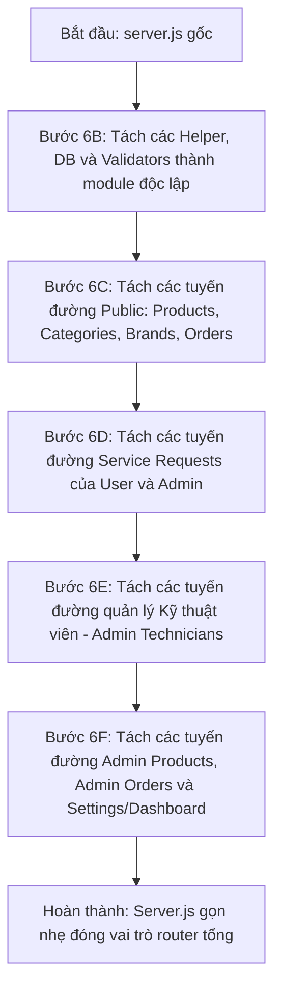

# KẾ HOẠCH REFACTOR VÀ TÁCH FILE MOCK-API/SERVER.JS

Tài liệu này lập bản đồ chi tiết cấu trúc hiện tại của `mock-api/server.js` và vạch ra lộ trình tách tệp tin một cách an toàn, đảm bảo không phá vỡ các nghiệp vụ quan trọng đã được sửa đổi và kiểm thử ở các bước trước.

---

## 1. MỤC TIÊU REFACTOR
* **Giảm tải kích thước tệp tin:** Tệp `server.js` hiện tại dài hơn 2.700 dòng, gây khó khăn cho việc đọc hiểu và bảo trì.
* **Tăng tính mô-đun:** Tách biệt các bộ phận chức năng: cấu hình cơ sở dữ liệu, hàm tiện ích (utils), trình xác thực (validators), và các nhóm tuyến đường (routes) cụ thể.
* **Chuẩn bị cho NestJS Migration:** Giúp cấu trúc của Mock API gần gũi hơn với kiến trúc phân lớp (Controller/Service) của NestJS, hỗ trợ quá trình migrate sau này diễn ra trơn tru.

---

## 2. NGUYÊN TẮC KHÔNG PHÁ VỠ API CONTRACT
* **Không đổi đường dẫn API:** Giữ nguyên toàn bộ các endpoint hiện có.
* **Không đổi cấu trúc phản hồi (Response Shape):** Đảm bảo cấu trúc JSON trả về (`success`, `message`, `data`, `pagination`, `error`) khớp tuyệt đối.
* **Không đổi mã trạng thái HTTP (HTTP Status Codes):** Ví dụ: thành công trả về `200`, tạo mới thành công trả về `201`, lỗi dữ liệu trả về `400`, lỗi xác thực trả về `401`.
* **Không thêm thư viện (package) mới:** Chỉ sử dụng các thư viện cốt lõi có sẵn trong `package.json` của `mock-api`.

---

## 3. BẢN ĐỒ CHI TIẾT MOCK-API/SERVER.JS

### 3.1 Nhóm Helper và Cấu hình (Dòng 1 - 200)
* **Imports & Middleware:** `express`, `cors`, `fs`, `path`, `crypto`. CORS cấu hình cho phép cổng `5173` và `5174`.
* **Hằng số toàn cục (Global Constants):** 
  * `VALID_SERVICE_STATUSES`, `VALID_SERVICE_PRIORITIES`, `VALID_TECHNICIAN_STATUSES`, `VALID_ORDER_STATUSES`, `VALID_PAYMENT_STATUSES`, `VALID_PAYMENT_METHODS`, `ACTIVE_SERVICE_REQUEST_STATUSES`.
* **Database Helpers:**
  * `readDb()`: Đọc dữ liệu từ `mock-db.json`. Nếu tệp chưa tồn tại, tự động gọi `getInitialData()` để sinh dữ liệu seed ban đầu và ghi lại.
  * `writeDb(db)`: Ghi dữ liệu vào `mock-db.json`.
* **Response Helpers:**
  * `respondSuccess(res, data, message, pagination)`
  * `respondCreated(res, data, message)`
  * `respondError(res, status, message, errorCode)`
* **Utility Helpers:**
  * `slugify(text)`
  * `updateTechnicianStatusAfterJobChange(techId, db, excludeRequestId)`: Tự động đếm công việc hoạt động của thợ và cập nhật trạng thái `busy`/`available`.
* **Middlewares:**
  * `requireAdminAuth`: Xác thực token admin qua bộ nhớ tạm `adminSessions`.

### 3.2 Nhóm API Public & User (Dòng 2000 - 2200)
| Method | Path | Đọc/Ghi Collection | Helper sử dụng | Nghiệp vụ cần bảo vệ | Test bảo vệ |
|---|---|---|---|---|---|
| `GET` | `/api/v1/products` | `products`, `categories`, `brands` | `respondSuccess` | Lọc theo category, brand, tìm kiếm theo tên sản phẩm. | `check:all` |
| `GET` | `/api/v1/products/:slug` | `products` | `respondSuccess`, `respondError` | Trả về sản phẩm theo slug. | `check:all` |
| `GET` | `/api/v1/categories` | `categories` | `respondSuccess` | Trả về danh mục. | `check:all` |
| `GET` | `/api/v1/brands` | `brands` | `respondSuccess` | Trả về thương hiệu. | `check:all` |
| `POST` | `/api/v1/orders` | `orders`, `products`, `customers`, `settings` | `respondCreated`, `respondError` | **Server-side Pricing**: Tự tính phí ship, voucher, chiết khấu, trừ tồn kho và validate chặt chẽ. | `test_order_pricing.js` |
| `GET` | `/api/v1/orders/track` | `orders` | `respondSuccess`, `respondError` | Khách hàng tra cứu đơn hàng bằng số điện thoại. | `check:all` |
| `POST` | `/api/v1/service-requests` | `serviceRequests`, `serviceCategories` | `respondCreated`, `respondError` | Chuẩn hóa số điện thoại, tự thêm tiền tố `"Quận "` cho `district`. | `test_enum_contract.js` |
| `GET` | `/api/v1/my-services` | `serviceRequests` | `respondSuccess` | Tra cứu yêu cầu sửa chữa theo số điện thoại khách hàng. | `check:all` |

### 3.3 Nhóm API Admin Auth & Dashboard (Dòng 200 - 450 & Các endpoint admin)
| Method | Path | Đọc/Ghi Collection | Helper sử dụng | Nghiệp vụ cần bảo vệ | Test bảo vệ |
|---|---|---|---|---|---|
| `POST` | `/api/v1/admin/auth/login` | Bộ nhớ tạm `adminSessions` | `respondSuccess`, `respondError` | Tạo và lưu phiên hoạt động của admin. | `check:all` |
| `GET` | `/api/v1/admin/auth/me` | Bộ nhớ tạm `adminSessions` | `respondSuccess` | Trả về thông tin admin hiện tại. | `check:all` |
| `POST` | `/api/v1/admin/auth/logout` | Bộ nhớ tạm `adminSessions` | `respondSuccess` | Hủy phiên làm việc. | `check:all` |
| `GET` | `/api/v1/admin/dashboard` | `products`, `orders`, `serviceRequests`, `technicians` | `requireAdminAuth`, `respondSuccess` | Tổng hợp doanh thu, số lượng thợ bận/rảnh, đơn hàng chờ xử lý. | `check:all` |

### 3.4 Nhóm API Admin Products & Orders (Dòng 2200 - 2400)
| Method | Path | Đọc/Ghi Collection | Helper sử dụng | Nghiệp vụ cần bảo vệ | Test bảo vệ |
|---|---|---|---|---|---|
| `GET` | `/api/v1/admin/products` | `products` | `requireAdminAuth`, `respondSuccess` | Lấy danh sách sản phẩm quản trị. | `check:all` |
| `POST` | `/api/v1/admin/products` | `products` | `requireAdminAuth`, `respondCreated`, `respondError` | Validate `basePrice > 0`, `salePrice <= basePrice`, `stock >= 0`. | `check:all` |
| `PATCH` | `/api/v1/admin/products/:id` | `products` | `requireAdminAuth`, `respondSuccess`, `respondError` | Cập nhật sản phẩm, validate giá và tồn kho. | `check:all` |
| `DELETE` | `/api/v1/admin/products/:id` | `products` | `requireAdminAuth`, `respondSuccess` | Xóa sản phẩm. | `check:all` |
| `GET` | `/api/v1/admin/orders` | `orders` | `requireAdminAuth`, `respondSuccess` | Lấy danh sách đơn hàng quản trị. | `check:all` |
| `PATCH` | `/api/v1/admin/orders/:id/status` | `orders`, `products` | `requireAdminAuth`, `respondSuccess`, `respondError` | Đổi trạng thái đơn hàng. Hủy đơn hàng tự hoàn lại tồn kho (`stock`). | `check:all` |

### 3.5 Nhóm API Admin Service Requests & Technicians (Dòng 2400 - 2748)
| Method | Path | Đọc/Ghi Collection | Helper sử dụng | Nghiệp vụ cần bảo vệ | Test bảo vệ |
|---|---|---|---|---|---|
| `GET` | `/api/v1/admin/service-requests` | `serviceRequests` | `requireAdminAuth`, `respondSuccess` | Lấy danh sách yêu cầu sửa chữa kèm bộ lọc. | `check:all` |
| `PATCH` | `/api/v1/admin/service-requests/:id/status` | `serviceRequests`, `technicians` | `requireAdminAuth`, `respondSuccess`, `respondError` | Kiểm soát luồng chuyển đổi trạng thái nghiêm ngặt, tự động giải phóng thợ khi hoàn thành/hủy. | `test_service_request_lifecycle.js` |
| `PATCH` | `/api/v1/admin/service-requests/:id/assign-technician` | `serviceRequests`, `technicians` | `requireAdminAuth`, `respondSuccess`, `respondError` | Phân công thợ: validate kỹ năng (`skills`), địa bàn (`workingAreas`), và trạng thái thợ. | `test_service_request_lifecycle.js` |
| `GET` | `/api/v1/admin/technicians` | `technicians` | `requireAdminAuth`, `respondSuccess` | Lấy danh sách thợ kỹ thuật. | `check:all` |
| `POST` | `/api/v1/admin/technicians` | `technicians` | `requireAdminAuth`, `respondCreated`, `respondError` | Thêm thợ mới: validate định dạng SĐT Việt Nam, email, chống trùng lặp. | `test_technician_rules.js` |
| `PATCH` | `/api/v1/admin/technicians/:id` | `technicians` | `requireAdminAuth`, `respondSuccess`, `respondError` | Cập nhật hồ sơ: **Whitelist PATCH** (chặn ghi đè trường cấm), khóa trạng thái nếu đang bận. | `test_technician_rules.js` |
| `DELETE` | `/api/v1/admin/technicians/:id` | `technicians` | `requireAdminAuth`, `respondSuccess`, `respondError` | Xóa hồ sơ thợ: chặn xóa nếu thợ đang bận (`busy`). | `test_technician_rules.js` |

---

## 4. CÁC BIỆN PHÁP BẢO VỆ NGHIỆP VỤ NHẠY CẢM

> [!WARNING]
> Khi thực hiện tách file, tuyệt đối không được làm ảnh hưởng đến các logic sau:
> 1. **Server-side Pricing:** Mọi con số về tiền đơn hàng phải do máy chủ tự động truy vấn và tính toán, không tin cậy dữ liệu client gửi lên.
> 2. **Trạng thái Thợ bận/rảnh:** Sự liên thông giữa trạng thái của Service Request (`assigned`) và Technician (`busy`) phải luôn đồng bộ.
> 3. **Nhất quán Quận/Huyện:** Tên địa bàn luôn được lưu trữ và so sánh ở dạng chuẩn hóa có tiền tố `"Quận "`.
> 4. **Khóa trạng thái (State Locking):** Thợ đang bận làm việc thì không được phép chuyển trạng thái hoạt động khác hoặc xóa hồ sơ.
> 5. **Chữ thường/chữ hoa của PaymentMethod:** Client gửi/nhận dạng chữ thường (`cod`), DB lưu dạng chữ hoa (`COD`).

---

## 5. LỘ TRÌNH TÁCH FILE CHI TIẾT (AN TOÀN TỪNG BƯỚC)

Việc tách file sẽ được tiến hành qua các bước nhỏ độc lập. Sau mỗi bước, phải chạy kiểm tra tĩnh và kiểm thử động để chắc chắn không phát sinh lỗi.



### Bước 6B: Tách các Helper, DB và Validators
* **Công việc:** 
  * Tạo các tệp tiện ích: `mock-api/utils/db.js` (chứa `readDb`, `writeDb`, `getInitialData`), `mock-api/utils/response.js` (chứa `respondSuccess`, `respondCreated`, `respondError`), và `mock-api/utils/validators.js` (chứa kiểm tra SĐT, email, rating).
  * Import các tệp này vào `server.js` và dọn dẹp phần đầu file.
* **Xác minh bắt buộc:** Chạy `npm run check:all`.

### Bước 6C: Tách các tuyến đường Public (Khách hàng)
* **Công việc:**
  * Tạo `mock-api/routes/public-products.js` (các API lấy sản phẩm, danh mục, thương hiệu).
  * Tạo `mock-api/routes/public-orders.js` (API tạo đơn hàng, tra cứu đơn hàng).
* **Xác minh bắt buộc:** Chạy `node scratch/test_order_pricing.js` và `npm run check:all`.

### Bước 6D: Tách các tuyến đường Service Requests
* **Công việc:**
  * Tạo `mock-api/routes/service-requests.js` chứa cả API đặt lịch của khách hàng và các API duyệt/phân công/hoàn thành của Admin.
* **Xác minh bắt buộc:** Chạy `node scratch/test_service_request_lifecycle.js` và `npm run check:all`.

### Bước 6E: Tách các tuyến đường Admin Technicians
* **Công việc:**
  * Tạo `mock-api/routes/admin-technicians.js` chứa các API thêm, sửa, xóa, khóa trạng thái thợ.
* **Xác minh bắt buộc:** Chạy `node scratch/test_technician_rules.js` và `npm run check:all`.

### Bước 6F: Tách các tuyến đường quản lý của Admin còn lại
* **Công việc:**
  * Tạo `mock-api/routes/admin-products.js`, `mock-api/routes/admin-orders.js`, và `mock-api/routes/admin-dashboard.js`.
  * Tệp `server.js` chính tại root lúc này chỉ còn chứa cấu hình Express, Middleware, import các Router và khởi chạy cổng 3001.
* **Xác minh bắt buộc:** Chạy `node scratch/test_enum_contract.js` và `npm run check:all`.

---

## 6. DANH SÁCH LỆNH KIỂM THỬ BẮT BUỘC SAU MỖI BƯỚC
Mọi bước tách file đều phải thực thi chuỗi lệnh sau để đảm bảo an toàn tuyệt đối:
```bash
# 1. Chạy tất cả các test case nghiệp vụ tự động
node scratch/test_order_pricing.js
node scratch/test_service_request_lifecycle.js
node scratch/test_technician_rules.js
node scratch/test_enum_contract.js

# 2. Chạy kiểm tra tĩnh toàn dự án (Typecheck & ESLint)
npm run check:all
```
Danh sách kiểm thử trên đảm bảo mọi khía cạnh nghiệp vụ phức tạp nhất đều được bảo vệ toàn diện trong quá trình tái cấu trúc mã nguồn.
